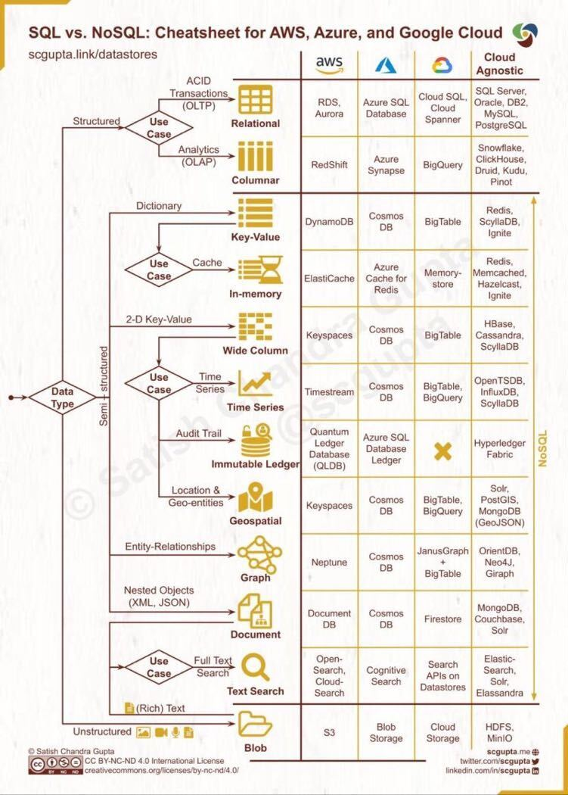

<!-- @import "[TOC]" {cmd="toc" depthFrom=1 depthTo=6 orderedList=false} -->
<!-- code_chunk_output -->

- [storage and file types](#storage-and-file-types)
  - [Data Warehousing / Data Lakes](#data-warehousing--data-lakes)
    - [Data Warehouse(DWH) vs Data Lake(DL) vs Lake House(LH)](#data-warehousedwh-vs-data-lakedl-vs-lake-houselh)
  - [access pattern(storage layer에 어떤 방식으로 access 하는가)](#access-patternstorage-layer에-어떤-방식으로-access-하는가)
  - [how to decide which storage to use](#how-to-decide-which-storage-to-use)
    - [Row vs Columnar Storage](#row-vs-columnar-storage)
  - [file types](#file-types)
  - [compression](#compression)
  - [partitions strategies](#partitions-strategies)
    - [date partitioning](#date-partitioning)
    - [Horizontal partitioning(sharding)](#horizontal-partitioningsharding)
    - [Vertical partitioning](#vertical-partitioning)
    - [Functional partitioning](#functional-partitioning)

## storage and file types

### Data Warehousing / Data Lakes

#### Data Warehouse(DWH) vs Data Lake(DL) vs Lake House(LH)

공통적으로 이 것들의 목적은 발생한 데이터를 한 곳에 모으는 것(aggregation)이다.  
그러나 data model과 목적에 따라 DWH, DL, LH을 구별하여 사용한다.

DWH

- 구조화된 데이터, OLTP, 쓰기 위주의 연산, ACID-compliant database transactions
- Notably, Data Warehouses particularly struggle with support for advanced data engineering, data science, and machine learning.
- [Kimball](https://www.kimballgroup.com/data-warehouse-business-intelligence-resources/kimball-techniques/dimensional-modeling-techniques/) 스타일의 모델링 적용

DL

- 모든 타입의 데이터이되 OLAP에 특화, 읽기 위주의 연산, API connectivity, 높은 압축 형식을 가진 file types(ex - parquet)로 저장하는 형식
- Data Lakes sometimes notoriously struggle with data quality, transactional support, data governance, and query performance issues.
- file 기반 스토리지가 쓰이는 data lake라고 할지라도 interface는 SQL-based라서 일반 RDBMS와 비슷하게 느껴지지만 내부의 기술적 내용은 많이 다르다.
  - The backend processing engines are completely different
  - The size of the data is usually completely different

LH

- DWH와 DL을 조합하여 운용하는 아키텍처 방식.
- https://towardsdatascience.com/the-fundamentals-of-data-warehouse-data-lake-lake-house-ff640851c832
- https://www.databricks.com/product/data-lakehouse
- https://aws.amazon.com/ko/blogs/big-data/build-a-lake-house-architecture-on-aws/

### access pattern(storage layer에 어떤 방식으로 access 하는가)

작성 예정

### how to decide which storage to use

#### Row vs Columnar Storage

- 행 기반 스토리지

  - 일반 RDBMS
  - OLTP, online transaction processing (온라인 트랜잭션, insert, update, delete)에 주로 사용
  - 서비스를 위한 DB
  - 쿼리 → 적은 양의 데이터를 가져오고 변형하는 일이 잦다.

- 열 기반 스토리지
  - snowflake, big query, redshift
  - OLAP, online analytical processing. (select, computation)에 주로 사용
    - [참고) Luft: 유저 행동 분석에 최적화된 OLAP 데이터베이스](https://engineering.ab180.co/stories/introducing-luft)
  - 사용자의 의사결정에 도움을 주는 것으로 데이터 분석, 데이터 마이닝에 주로 사용된다.
  - 분석 → 많은 양의 데이터를 가져오고 그걸 활용하지, 여러번 요청하지 않는다.
  - 결론적으로 데이터 웨어 하우스에서 대규모 데이터셋을 다루기에 좋다는 것이다.

### file types

Choosing Parquet vs Avro vs JSON vs CSV vs HDF5 vs RDBMS. These decisions should be driven by the data needs and access patterns. Files have become the defacto new data lake.

1. [parquet](https://parquet.apache.org/)
2. [avro](https://avro.apache.org/)
   - Avro vs Parquet
     - https://medium.com/@synabreu/how-to-load-data-efficiently-in-bigquery-7af8cb5bee33
     - https://www.snowflake.com/trending/avro-vs-parquet
3. [orc](https://orc.apache.org/)
4. csv or file
5. json

### compression

1. gzip
2. tar
3. snappy
4. zip

### partitions strategies

partition?

- 데이터를 논리적으로, 물리적으로 분리, 정리하는 것이다. 단순히 데이터를 어떻게 구분하여 저장할 것이가에 대한 이야기이고, partition을 잘 해야 데이터를 빠르게 읽을 수 있다.
- Partitioning can improve scalability, reduce contention, and optimize performance. It can also provide a mechanism for dividing data by usage pattern. ([Data partitioning guidance](https://learn.microsoft.com/en-us/azure/architecture/best-practices/data-partitioning))

#### date partitioning

- 날짜별로 데이터를 분리하여 저장하는 기법은 bigquery를 비롯한 제품 뿐만 아니라 각종 빅데이터 플랫폼에서 date partitioning이 사용된다. 이는 보통 날짜별 집계 방식으로 데이터가 생성되고 소비되는 경향 때문이다.
- bigquery 기준, 테이블 생성시에는 파티션 테이블로 관리 하는게 데이터 비용 및 성능에 효율적이며 파티션 테이블을 조회 하는 경우 파티션 컬럼에 조건절로 날짜를 걸어 두는 것이 좋다.

#### Horizontal partitioning(sharding)

#### Vertical partitioning

#### Functional partitioning
